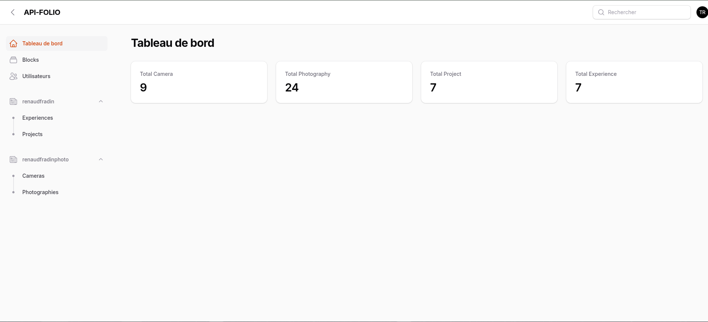
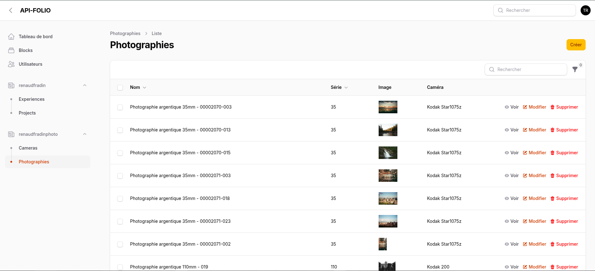
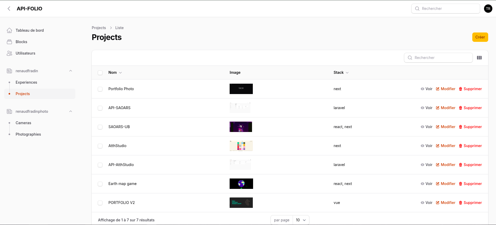

<h1 align="center">
  API-FOLIO
</h1>

## About

The API forms the back office of my websites.
It centralizes data management and essential functionalities.

<br />

L’API constitue le back-office de mes sites.
Elle centralise la gestion des données et les fonctionnalités essentielles.

### View

<p>API et BackOffice pour AtthStudio</p>





### 🛠 Installation & Set Up

1. Install dependencies

```sh
composer install
```

2. Run migration and factory

```sh
./vendor/bin/sail migrate
```

```sh
./vendor/bin/sail artisan migrate:fresh --seed
```

3. Start the development server

```
./vendor/bin/sail up
```

4. Access the API

```
http://127.0.0.1:8001
```

<!-- ### 📚 Documentation

[API Documentation](https://api-saoars.up.railway.app/api/documentation) -->
