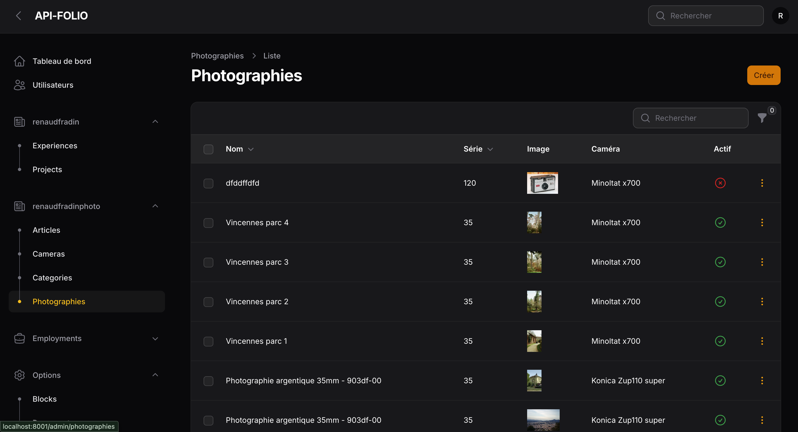
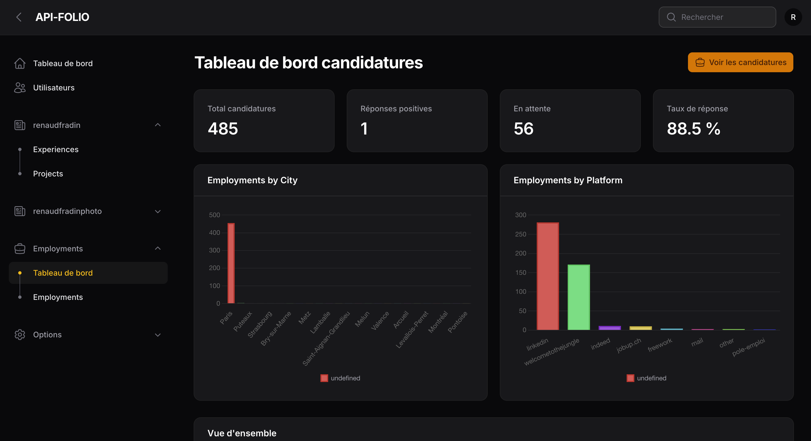

<h1 align="center">
  API-FOLIO
</h1>

## About

The API forms the back office of my websites.
It centralizes the management of data and key functionalities, and also serves as my CRM to help me stay organized.
<br />

L’API constitue le back-office de mes sites.
Elle centralise la gestion des données et des fonctionnalités clés, et me sert également de CRM pour m'organiser.

### View

<p>API et BackOffice pour Api-Folio</p>





### 🛠 Installation & Set Up

1. Install dependencies

```sh
composer install
```

2. Run migration and factory

```sh
./vendor/bin/sail migrate
```

```sh
./vendor/bin/sail artisan migrate:fresh --seed
```

3. Start the development server

```sh
./vendor/bin/sail up
```

4. Run tests

```sh
./vendor/bin/pest
```

5. Access the API

```
http://127.0.0.1:8001
```

### 📚 Documentation

[API Documentation](https://api-folio.up.railway.app/api/documentation)

[BackOffice](https://api-folio.up.railway.app/admin)

### 🐶 Bruno (API Client)

Collection Bruno versionnée dans [`bruno/`](bruno/) pour tester et référencer tous les endpoints API.

1. Installer [Bruno](https://www.usebruno.com/)
2. Ouvrir la collection : **Open Collection** → dossier `bruno/`
3. Sélectionner l'environnement **Local** (port `8001`) ou **Production**
4. Pour les endpoints `show`, seed les données de test :

```sh
./vendor/bin/sail artisan db:seed --class=BrunoSeeder
```

Exécution CLI :

```sh
npm install
npm run bruno:run
```

Voir [`bruno/README.md`](bruno/README.md) pour le détail.

[Demo](https://api-folio.up.railway.app/admin)

user: demo@gmail.com
password: b$K!*g+h4:v6cjaO4SPL/
